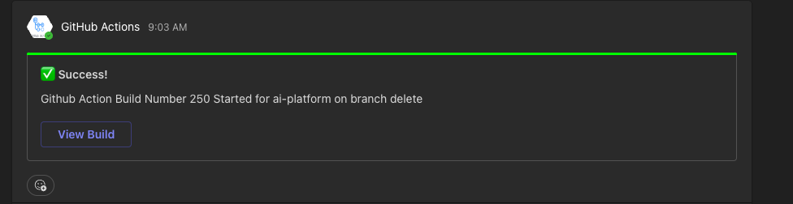
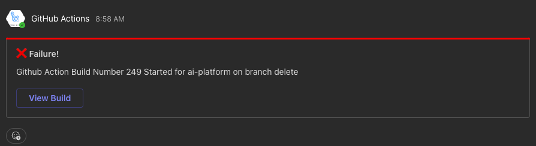

<!-- action-docs-header source="action.yml" -->

<!-- action-docs-header source="action.yml" -->

<!-- action-docs-inputs source="action.yml" -->
## Inputs

| name | description | required | default |
| --- | --- | --- | --- |
| `webhook_url` | <p>The Microsoft Teams Incoming Webhook URL</p> | `true` | `""` |
| `message` | <p>The message to send to Microsoft Teams</p> | `true` | `""` |
| `status` | <p>The status of the message; expect values from needs.<job_id>.result</p> | `true` | `""` |
<!-- action-docs-inputs source="action.yml" -->

<!-- action-docs-outputs source="action.yml" -->

<!-- action-docs-outputs source="action.yml" -->

<!-- action-docs-usage source="action.yml" project="aliciousness/teams-notifier" version="v1.3.0" -->
## Usage

```yaml
- uses: aliciousness/teams-notifier@v1.3.0
  with:
    webhook_url:
    # The Microsoft Teams Incoming Webhook URL
    #
    # Required: true
    # Default: ""

    message:
    # The message to send to Microsoft Teams
    #
    # Required: true
    # Default: ""

    status:
    # The status of the message; expect values from needs.<job_id>.result
    #
    # Required: true
    # Default: ""
```
<!-- action-docs-usage source="action.yml" project="aliciousness/teams-notifier" version="v1.3.0" -->
## Usage

```yaml
- uses: aliciousness/teams-notifier@v1.1.0
  with:
    webhook_url:
    # The Microsoft Teams Incoming Webhook URL
    #
    # Required: true
    # Default: ""

    message:
    # The message to send to Microsoft Teams
    #
    # Required: true
    # Default: ""

    status:
    # The status of the message; expect values from needs.<job_id>.result
    #
    # Required: true
    # Default: ""
```
<!-- action-docs-usage source="action.yml" project="aliciousness/teams-notifier" version="v1.1.0" -->
## Usage

```yaml
- uses: aliciousness/teams-notifier@v1.0.0
  with:
    webhook_url:
    # The Microsoft Teams Incoming Webhook URL
    #
    # Required: true
    # Default: ""

    message:
    # The message to send to Microsoft Teams
    #
    # Required: true
    # Default: ""

    status:
    # The status of the message; expect values from needs.<job_id>.result
    #
    # Required: true
    # Default: ""
```
<!-- action-docs-usage source="action.yml" project="aliciousness/teams-notifier" version="v1.0.0" -->

Here is what the MS teams Card will look like for success status:


Here is what the MS teams Card will look like for failure status:


> NOTE: To update the readme, just run the `npm run prebuild` This script will lint the code, and update the readme with the docs for said action using the [action.yml](./action.yml) file and the name of the project and version from your [package.json](./package.json) file